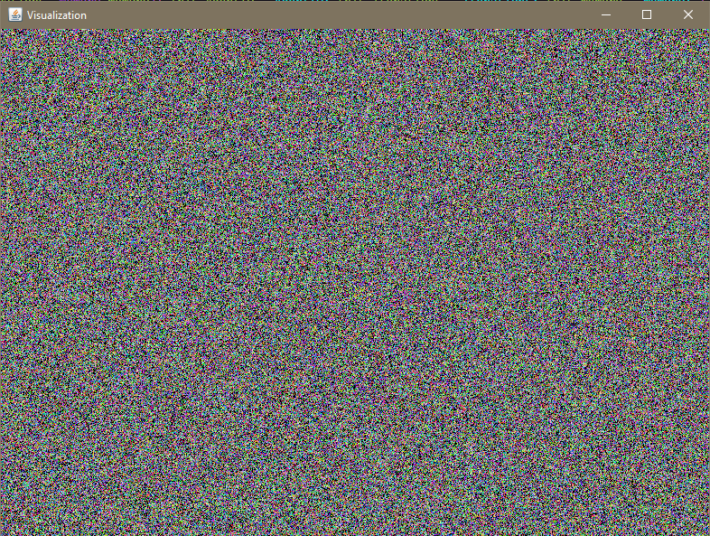

# Visualized Noise Generator

This is just a simple noise generator that uses 4 layered `Random` instances to get the address and value of a memory bank before writing to memory and pushing to the screen.